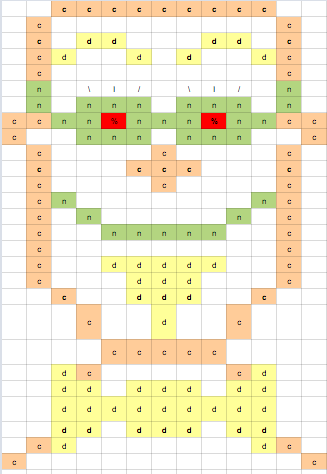

# Tetrad Custom Push-Pin Manipulation Tool

## Summary
Our project is to build a module where users can upload their custom images to create push-pin images which can be used to be displayed on Google Map. 

## Architecture
1. Back-end
..* Node.js: REST API provider. user verification. interaction with Amazon S3
....* express.js: web framework for building the REST API
....* AWS SDK: file upload/download redirect to S3 bucket
..* MySQL: stores image related data specific for each user
..* NGINX: web server
..* Docker: for a stream-lined development process
..* !!! testing framework

2. Front-end
..* React.js: single page application library
..* !!! testing framework

## Notes
* redirecting user image request to S3
..* using pipe
....* http://stackoverflow.com/questions/17516820/serving-files-stored-in-s3-in-express-nodejs-app
....* http://stackoverflow.com/questions/19883561/showing-an-image-from-amazon-s3-with-nodejs-expressjs-and-knox

